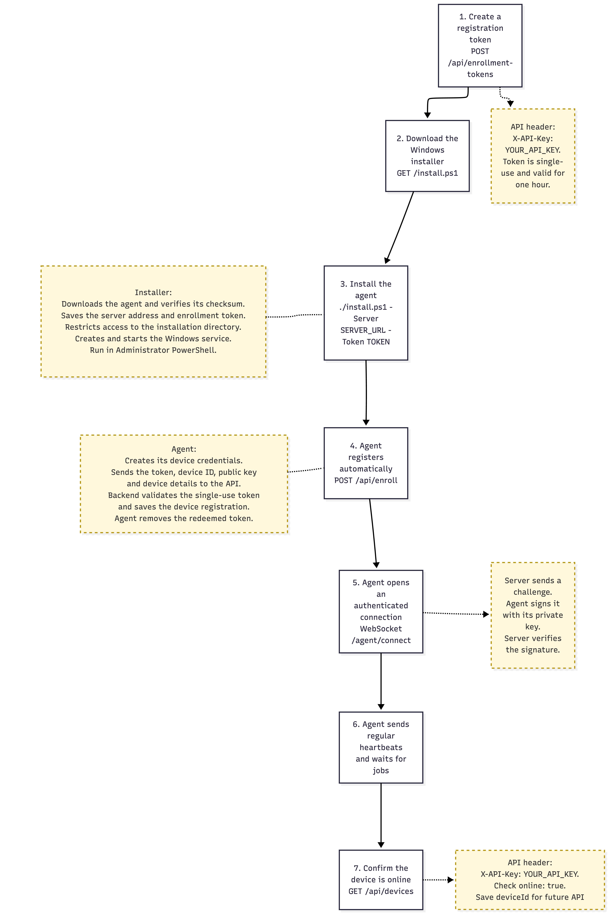
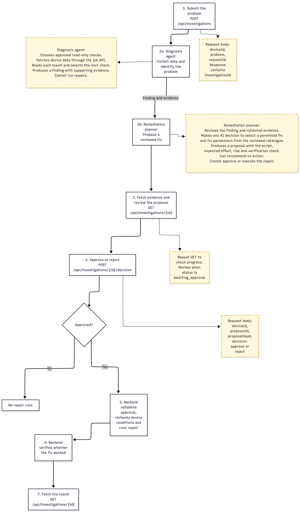

# System Architecture & Design Notes

The core philosophy of this system is **security and strict rules**. The software installed on the computers (the agent) is "dumb" by design—it doesn't make decisions; it just proves who it is, runs what it's told, and signs the results.

All the smart decisions are made by the main server (the control plane) and the AI. Most importantly, **safety rules are hardcoded into the system, not left up to the AI to figure out.**

## 1. How Devices Connect and Identify Themselves

**The Connection Model**

* **Outbound connection:** The agent always connects *out* to the server using WebSockets, so the endpoint needs no inbound network port.

* **Prove who you are:** Every time a device connects, the server gives it a random challenge. The device must sign this challenge with its private key, so knowing or copying a device ID is not enough to impersonate it.

* **Are you actually there?** An open network connection doesn't mean a computer is awake. The system only considers a device "online" if it has sent a "heartbeat" ping in the last 30 seconds.

* **Smart Reboot Detection:** The system doesn't guess if a computer restarted. It checks the computer's internal ticking clock (uptime). If the clock went backwards, or didn't advance enough, it knows a reboot happened.

* **Instant Kicks (Revocation):** If you revoke a device, the system immediately drops its connection, cancels its pending jobs, and locks it out.

**Device Identity**

* **IDs vs. keys:** A device ID is derived from Windows `MachineGuid`, but the ID alone is not proof of identity. The agent generates a P-256 private key, protects it with Windows DPAPI in machine scope, and stores it in a directory restricted to SYSTEM and Administrators. The agent proves possession of that key on every connection.

* **Tokens are temporary:** Enrolment tokens are one-time use and expire in an hour. They are just used to introduce the device to the server so it can register its secret key.

*This diagram shows the exact flow of how an agent uses a temporary token to securely register and open a continuous, authenticated connection.*

## 2. How Scripts (Jobs) Run

When you send a script to a computer, it goes through a strict lifecycle: `Dispatched ➔ Running ➔ Completed` (or `TimedOut` / `Failed` / `Unreachable`).

* **One Door In:** Every single command goes through one master checkpoint function. This ensures no request can skip security checks.

* **No Waiting in Line:** If a device is offline, the system immediately rejects the job (Error 409). It does not queue it up to run later. This prevents an AI from accidentally running a fix hours later when the computer's situation has completely changed.

* **Double-run protection:** When a caller supplies an idempotency key, repeating the same request returns the original job instead of running the script twice. Reusing the key for a different request is rejected.

* **Devices Sign Their Homework:** When a computer finishes running a script, it creates a secure summary of exactly what it ran and what the result was, and signs it with its secret key. If the server sees the signature is wrong, or the script was altered, it rejects the result.

## 3. The AI Layer (Smart but Fenced In)

The AI driver acts just like a human operator using the API. It has its own API key, and every move it makes is logged.

**High-Level Investigation Flow**

*As seen here, the AI is split into two parts: one that reads data (Diagnosis), and one that plans a fix (Remediation). A human always sits in the middle before any fix is applied.*

**Strict AI Rules**

* **Menus, not blank canvases:** The investigation and remediation agents cannot write PowerShell. They can only choose from a reviewed menu of eleven read-only diagnostics (six for system health, five for network connectivity) and four repairs. The separate operator jobs API still supports arbitrary PowerShell, as required for remote management.

* **Quarantined text:** Device output and user text are clearly labelled as untrusted and wrapped in randomized delimiters before a model sees them. This makes prompt injection harder; the catalogues, fixed device, execution budgets and human approval enforce the actual action boundary.

* **Strict Budgets:** The AI is not allowed to think forever. If it runs 12 checks, hits 6 errors, or takes longer than 5 minutes, it gives up. "I don't have enough evidence" is a perfectly acceptable answer.

**The Approval Gate**

*This detailed diagram outlines the background loops and the strict validation that happens when a fix is proposed and approved.*

* When you approve an AI's proposed fix, you are approving a specific action on a specific machine at that specific moment.

* **Trust, but Verify:** When you click "Approve," the server completely rebuilds the script from scratch based on the menu to ensure the AI didn't sneak anything into the text.

* **Last-second Check:** Right before the repair runs, the server checks the computer *again* to make sure the problem still exists. If things changed while you were deciding, it cancels the repair.

## 4. Future Roadmap

Here is what is planned for future updates:

1. **Scaling:** Move from SQLite to Postgres so multiple control-plane instances can coordinate safely.

2. **Double Signatures:** Having the server digitally sign the jobs it sends, so the agent can verify the server wasn't hacked.

3. **Permissions:** Creating specific roles (like Read-Only or AI-Only) assigned to specific groups of computers.

4. **Queued Jobs:** Adding an optional feature to let safe maintenance jobs wait in line for offline computers.

5. **Tamper-Proof Logs:** Cryptographically chaining the audit logs so hackers can't erase their tracks.

6. **Broader catalogue:** Use investigation history to identify useful new diagnostics and repairs, then require review and testing before adding them to the catalogue.
